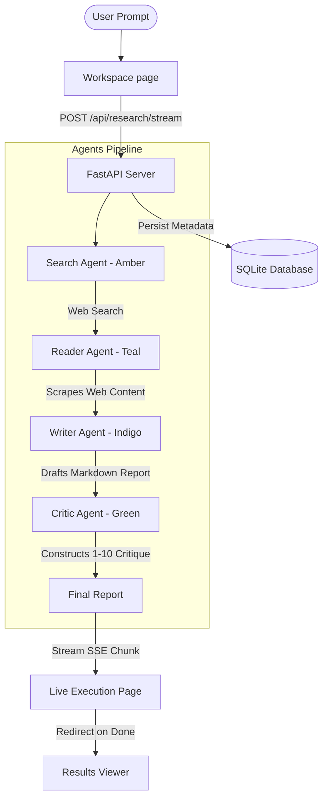

# OrchestrAI

> **Autonomous Multi-Agent AI Research Operating System**

OrchestrAI is a premium, production-grade AI-native operating environment where autonomous agents collaboratively perform deep web research, scrape pages, synthesize structured markdown reports, and critique their outputs in real time. 

It visualizes complex multi-agent pipelines with terminal-inspired observability, presenting a polished SaaS environment styled with minimalist dark themes, glassmorphism, and smooth animations.

---

## 🌟 Key Features

*   **Multi-Agent Collaborative Pipeline**:
    *   **Search Agent** (Amber): Dynamically scans web indices using Tavily search API.
    *   **Reader Agent** (Teal): Scrapes, sanitizes, and extracts raw page content using BeautifulSoup.
    *   **Writer Agent** (Indigo): Compiles gathered research into formatted Markdown reports.
    *   **Critic Agent** (Green): Critiques factuality, structures feedback, and scores draft documents.
*   **Real-time SSE Observability**: Direct Server-Sent Events (SSE) telemetry client streaming agent thinking processes, active tool badges, active steps, and live document generation.
*   **Dual-Pane Terminal Design**: Merges a visual graph pipeline showing agent transition flows with a scroll-locked monospace developer console log.
*   **Resilient Key Configuration**: Fallback engine supporting failovers, user settings updates, and an **Automatic Simulation Mode** letting you test the complete product even without immediate API credentials.
*   **Local History & Search**: Save reports to a local SQLite database, allowing users to browse, search, delete, and reopen past runs.

---

## 🏗️ Architecture Layout



---

## 📁 Separated Directory Structure

```
OrchestrAI/
├── README.md                 # Project Overview & Quick Start
├── docker-compose.yml        # Multi-service local orchestrator
├── backend/                  # Python FastAPI Backend Service
│   ├── main.py               # API Router & SSE Streaming
│   ├── pipeline.py           # LangChain Orchestrator & Simulator
│   ├── agents.py             # ReAct Agent Definitions
│   ├── tools.py              # Search & Scraping Engines
│   ├── database.py           # SQLite History Handler
│   ├── requirements.txt      # Python Dependencies
│   └── Dockerfile            # Backend Docker setup
└── frontend/                 # Vite + React Client SPA
    ├── package.json          # Node modules & dependencies
    ├── vite.config.ts        # Vite config with Dev API Proxy
    ├── tailwind.config.js    # Custom Tailwind variables and theme
    ├── src/                  # React Source
    │   ├── main.tsx          # Router mount
    │   ├── index.css         # Styling system
    │   ├── hooks/useSSE.ts   # EventSource handler hook
    │   ├── pages/            # View pages (Landing, Workspace, etc.)
    │   └── components/       # Functional reusable widgets
    └── Dockerfile            # Static build Docker configuration
```

---

## 🚀 Quick Start (Local Run)

### 1. Set Up Environment Keys
Create a `.env` file inside `/backend` (or copy `.env.example`):
```bash
GROQ_API_KEYS=gsk_your_key_1,gsk_your_key_2
TAVILY_API_KEYS=tvly_your_key_1
```
*Note: If no keys are provided, OrchestrAI will automatically run in **Simulation Mode** so you can view all agents and features immediately.*

### 2. Launch Backend Service
```bash
cd backend
python -m venv .venv
source .venv/bin/activate  # On Windows: .venv\Scripts\activate
pip install -r requirements.txt
python main.py
```
*Backend API will run at: `http://localhost:8000`*

### 3. Launch Frontend Client
```bash
cd frontend
npm install
npm run dev
```
*Frontend interface will run at: `http://localhost:5173`*

---

## 🐳 Docker Deployment

To spin up the entire production-grade stack (Frontend & Backend) in one command:
```bash
docker-compose up --build
```
*   Access the **Frontend Client** at: `http://localhost:3000`
*   Access the **Backend API** at: `http://localhost:8000`

---

## 🎨 Semantic Token Colors

Agent states are represented throughout the visual layout with consistent semantic accent styling:
*   🟡 **Search Agent**: `Amber` (`#f59e0b`)
*   🟢 **Reader Agent**: `Teal` (`#14b8a6`)
*   🔵 **Writer Agent**: `Indigo` (`#6366f1`)
*   🟢 **Critic Agent**: `Green` (`#22c55e`)
*   ⚫ **UI Theme**: Deep Grayscale Dark Mode (`#0a0a0a` / `#171717`)
